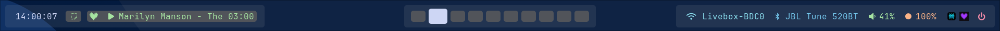

# Waybar config (top + dock)

Configuration Waybar pour Hyprland avec une barre supérieure “system” et une barre inférieure type dock (auto-hide).

## Screenshot



## Arborescence

```bash
~/.config/waybar
├── config                # barre du haut (non inclus ici)
├── style.css             # style barre du haut
├── config-bottom.jsonc   # dock du bas
├── style-bottom.css      # style dock du bas
└── power_menu.xml        # menu power (wofi / wlogout, etc.)
```

## Barre du bas : dock
config-bottom.jsonc définit une Waybar en mode dock, centrée en bas, avec auto-hide. 

### Principales options :

```text
{
  "name": "dockbar",
  "id": "dockbar",
  "layer": "bottom",
  "position": "bottom",
  "mod": "dock",
  "exclusive": true,
  "gtk-layer-shell": true,
  "height": 40,
  "margin-bottom": 10,
  "margin-left": 500,
  "margin-right": 500,
  "start_hidden": true,
  "on-sigusr1": "toggle",
  "on-sigusr2": "toggle",

  "modules-left": [
    "custom/space",
    "custom/launcher",
    "custom/separator"
  ],
  "modules-center": [
    "custom/deezer",
    "custom/firefox",
    "custom/perplexity",
    "custom/files",
    "custom/kitty"
  ],
  "modules-right": [
    "power-profiles-daemon",
    "battery",
    "custom/space"
  ]
}
```

### Modules principaux :
- custom/launcher : menu d’applications (wofi).
- custom/deezer : lance deezer-desktop.
- custom/firefox : lance firefox.
- custom/perplexity : lance perplexity (ton launcher perso).
- custom/files : lance thunar.
- custom/kitty : lance kitty.
- battery : état batterie (icône + pourcentage).
- power-profiles-daemon : profil d’alimentation courant.

Extraits de config de modules : 

```text
"custom/launcher": {
  "format": "",
  "on-click": "wofi --width=400 --height=500 --xoffset=500 --yoffset=430 --show drun",
  "tooltip": false
},

"custom/deezer": {
  "format": "",
  "on-click": "deezer-desktop",
  "tooltip": false
},

"battery": {
  "bat": "BAT1",
  "interval": 60,
  "states": {
    "warning": 30,
    "critical": 15
  },
  "format": "{icon} {capacity}%",
  "format-icons": ["", "", "", "", ""]
}
```

## Style barre du haut
style.css gère la barre principale (top), avec modules groupés gauche / centre / droite et un thème Catppuccin-like. 

### Caractéristiques :

Font : JetBrainsMono Nerd Font, 12pt.
Groupes .modules-left, .modules-center, .modules-right avec fond semi-transparent et bordures arrondies
Workspaces sous forme de pastilles compactes, avec état actif, hover et urgent.
Couleurs spécifiques pour réseau, bluetooth, audio, backlight, batterie, PPD, horloge, power, musique.

### Exemple pour les workspaces :

```css
#workspaces button {
  font-size: 2pt;
  border-radius: 5px;
  color: #bac2de;
  background: rgba(93, 93, 93, 0.8);
  padding: 0px 6px;
  margin-top: 6px;
  margin-bottom: 6px;
}

#workspaces button.active {
  color: #1e1e2e;
  font-weight: 600;
  background: #cdd6f4;
  padding: 0px 10px;
  margin-top: 2px;
  margin-bottom: 2px;
}
```

### Hover modules de droite :

```css
#network:hover,
#bluetooth:hover,
#wireplumber:hover,
#backlight:hover,
#battery:hover,
#power-profiles-daemon:hover,
#custom-power:hover,
#tray:hover,
#custom-music:hover {
  background: rgba(93, 93, 93, 0.8);
  border-radius: 5px;
  border-bottom: 1px solid #bb9af7;
  margin-bottom: 4px;
}
```

### Style dock (barre du bas)
style-bottom.css applique un look dock arrondi et des icônes qui grossissent au hover. 

Caractéristiques :

- Fond arrondi (border-radius: 16px;) et léger fond translucide.
- Icônes centre (deezer, firefox, perplexity, files, kitty) à 18px qui passent à 42px au survol.
- Batterie + power-profiles alignés à droite, avec hover souligné.

### Extraits :

```css
window#waybar {
  background: rgba(200, 200, 200, 0.1);
  border-radius: 16px;
  color: #c0caf5;
}

#custom-deezer,
#custom-firefox,
#custom-files,
#custom-perplexity,
#custom-kitty {
  border-radius: 12px;
  padding-left: 20px;
  padding-right: 20px;
  margin-top: 19px;
  margin-bottom: 19px;
  font-size: 18px;
}

#custom-deezer:hover,
#custom-firefox:hover,
#custom-files:hover,
#custom-kitty:hover,
#custom-perplexity:hover {
  font-size: 42px;
  margin-top: 1px;
  margin-bottom: 1px;
}
```

## Dépendances
Principaux paquets nécessaires : 
- waybar
- wofi (launcher)
- thunar (fichiers, ou adapter la commande)
- kitty
- firefox
- deezer-desktop
- perplexity (script ou binaire perso dans $PATH)
- power-profiles-daemon
- fonts : JetBrainsMono Nerd Font, et Nerd Fonts pour les icônes (, , etc.)
- wlogout 
- NetworkManagerGtk
- Hyprpicker
- Blueman-manager

## Intégration Hyprland
La Waybar est lancée depuis la config Hyprland (exemple) :

```text
exec-once = waybar -c ~/.config/waybar/config -s ~/.config/waybar/style.css
exec-once = waybar -c ~/.config/waybar/config-bottom.jsonc -s ~/.config/waybar/style-bottom.css
```
